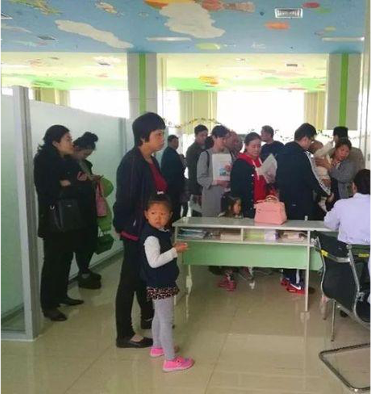

<h1 align="center">小核桃早教</h1>

  <h3>
    <a href="https://github.com/skyxiaoc/sifou_hackathon#作品介绍">
      作品介绍
    </a>
     | 
    <a href="https://github.com/skyxiaoc/sifou_hackathon#团队介绍">
      团队介绍
    </a>
     | 
    <a href="https://github.com/skyxiaoc/sifou_hackathon#联系方式">
      联系方式
    </a>
     | 
    <a href="https://github.com/skyxiaoc/sifou_hackathon#安装&编译指南">
      安装&编译指南
    </a>
    
  </h3>

## 作品介绍

### 解决的“垂类场景实际问题”：
    1）无法大量及时回复老人发育咨询
    2）一般关键词回复类解决方案对于老人输入能造成的“意图识别”
 
### 线上应用：
* 抖音短视频、直播、评论区挂载；
* 二维码海报转发老年群微信；

  

### 线下应用：
* 全国各地的婴幼儿疫苗体检中心
* 社区医院扫码

  

## 作品截图

      

## 团队介绍
**为本次马拉松成立，在短时间（周末）内找到创意和技术选型**
* 兰毅
    * 团队职责：产品&项目管理 
    * 有5年教育、银发项目经验
    * 10年公益行业经验
    * 北京某教育专家智库理事

* 周晨阳
    * 团队职责：技术选型&技术开发
    * 浙江工商大学杭州商学院 计算机科学与应用专业学生

* 黄璞
    * 团队职责：UI/UX设计
    * Thoughtworks UI/UX

## 联系方式
**zonghengnihao@sina.com**

## 安装&编译指南
### 依赖

    python >= 3.6
    tensorflow 1.14.0
    bert

### 下载bert预训练模型

    $ wget -c https://storage.googleapis.com/bert_models/2018_11_03/chinese_L-12_H-768_A-12.zip
    $ unzip chinese_L-12_H-768_A-12.zip 
    

### 下载bert源代码
下载 [**bert**](https://github.com/google-research/bert) 放入项目目录**bert**下，

    $ git clone https://github.com/google-research/bert.git
    
### 数据样例
{"question": "最佳辅食", "answer": "婴儿营养米粉是最佳辅食"}
{"question": "辅食菜泥的具体制作方法", "answer": "将整根的菜叶放入滚开的水中数秒钟，变成深绿色，且稍变软，即可做出菜泥"}
{"question": "辅食的注意事项", "answer": "过早给孩子加食盐，增加高血压的风险。加糖增加出现龋齿的风险"}

### 模型训练
**模型训练之前请将所有需要用到的文件下载完毕**

    $ python model.py --task=train \
        --is_training=True \
        --epoch=100 \
        --size_layer=256 \
        --bert_config=chinese_L-12_H-768_A-12/bert_config.json \
        --vocab_file=chinese_L-12_H-768_A-12/vocab.txt \
        --num_layers=2 \
        --learning_rate=0.001 \
        --batch_size=16 \
        --checkpoint_dir=result

### 模型测试与部署
1. 模型训练完毕后，运行webapi.py即可开启本机测试接口
2. 模型通过flask框架共享预测接口，前端通过api方式（post）进行预测
3. 前端通过uniapp进行搭建，源码以给出，可以进行跨平台多端部署
### 使用到的 Google 技术
基于tensorflow-bert-seq2seq实现老人（NLP）意图识别的“宝宝发育咨询抖音小程序”